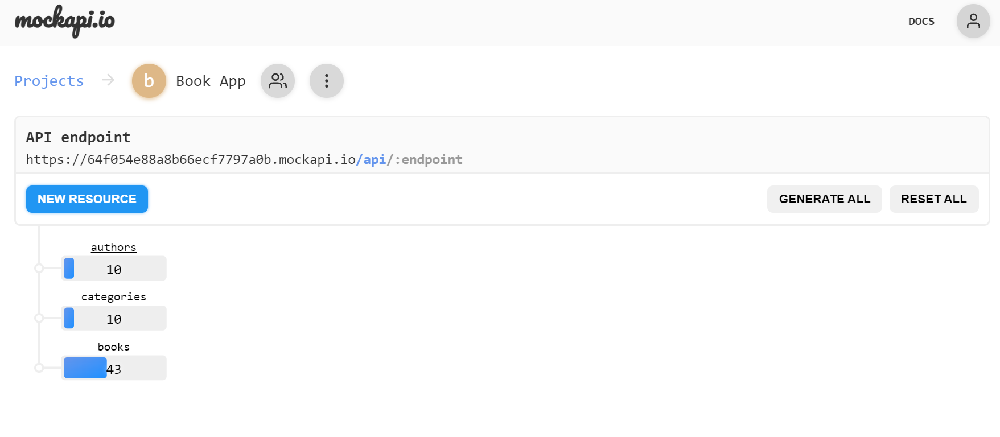
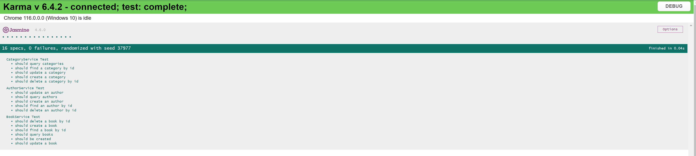
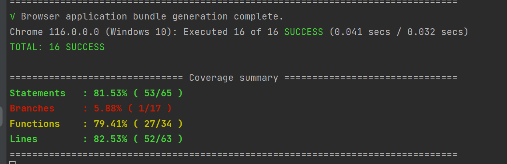

# BookApp

This project was generated with [Angular CLI](https://github.com/angular/angular-cli) version 16.2.0.

## Development server

Run `ng serve` for a dev server. Navigate to `http://localhost:4200/`. The application will automatically reload if you change any of the source files.

## Backend server API

For the backend server API, I used mockapi.io create three end points. You can see the API documentation from this link: https://github.com/mockapi-io/docs/wiki.

* The API endpoints are.
  * https://64f054e88a8b66ecf7797a0b.mockapi.io/api/books.
  * https://64f054e88a8b66ecf7797a0b.mockapi.io/api/authors.
  * https://64f054e88a8b66ecf7797a0b.mockapi.io/api/categories
    

## Code scaffolding

Run `ng generate component component-name` to generate a new component. You can also use `ng generate directive|pipe|service|class|guard|interface|enum|module`.

## Build

Run `npm run prod` to build the project for production. The build artifacts will be stored in the `dist/` directory.

## Deployment

Deployed with Docker on Azure . You can see the live demo from this link: https://habibbookapplication.azurewebsites.net/book
The deployment steps are:

* `docker build -t book-app-image .`
* `docker run -d -p 8080:80 book-app-image` Test the image locally
* `docker tag book-app-image:latest bookapplicationregistry.azurecr.io/book-app-image:latest`  Tag the image after testing and login to Azure Container Registry.
* `docker push bookapplicationregistry.azurecr.io/book-app-image:latest` Push the image to Azure Container Registry.
## Running unit tests

Run `ng test` to execute the unit tests via [Karma](https://karma-runner.github.io).

* Karma Web browser test results.

* Test results in the console.

## Running end-to-end tests

Run `ng e2e` to execute the end-to-end tests via a platform of your choice. To use this command, you need to first add a package that implements end-to-end testing capabilities.

## Further help

To get more help on the Angular CLI use `ng help` or go check out the [Angular CLI Overview and Command Reference](https://angular.io/cli) page.
